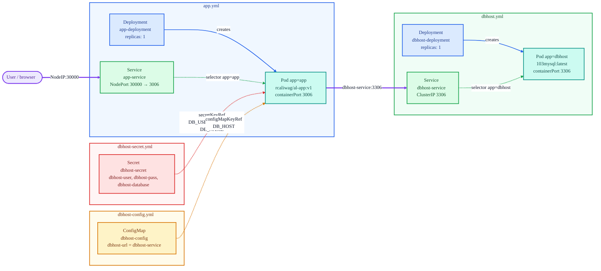

# Kubernetes Manifest Interactions

How the four YAML files in this directory relate to each other.



**Legend:** purple = live request traffic, blue = owns/creates, green = label selector,
red = secret injection, amber = config injection. Dotted edges are name-based references
resolved at runtime, solid edges are ownership.

## Coupling points

- `dbhost-secret.yml` and `dbhost-config.yml` are referenced only by name from `app.yml`
  (`secretKeyRef: dbhost-secret`, `configMapKeyRef: dbhost-config`). Nothing enforces ordering,
  so apply them before `app.yml` or the pod stalls in `CreateContainerConfigError`.
- The ConfigMap value `dbhost-url: dbhost-service` is the link between the two Deployments. It is
  the Service name from `dbhost.yml`, resolved through cluster DNS. Rename that Service and the
  app breaks silently.
- Services select pods by label, not by Deployment name. The `app: app` and `app: dbhost` labels in
  the pod templates are the actual glue.

## Apply order

```sh
kubectl apply -f dbhost-config.yml
kubectl apply -f dbhost-secret.yml
kubectl apply -f dbhost.yml
kubectl apply -f app.yml
```

## The four API object roles

Each file is a different `kind:` of Kubernetes API object. The course recap:

| Object | Role here |
|---|---|
| **ConfigMap** | Non-sensitive key-value data. The only value stored is the database URL. |
| **Secret** | Base64-encoded sensitive data: the Database username and password, plus the database name (kept here rather than the ConfigMap for extra security). |
| **Deployment Manifest** | The desired state of a Pod. `spec:` defines the Pod; `template:` configures the container within. |
| **Service** | How to connect to a Pod. `dbhost-service` for in-cluster access to the Database; `app-service` for browser access to the App. |
| **NodePort** | A Service type allowing inbound traffic from outside Kubernetes. Not strictly an API object of its own, but without it the app is sealed off from the outside world. |

Base64 in the Secret is **encoding, not encryption**. Values are decoded trivially; real encryption
has to be enabled as a feature inside etcd.

## Naming convention

Every object follows `<service name>-<API object kind>`, with the kind often shortened:

- `dbhost` + ConfigMap becomes `dbhost-config`
- `dbhost` + Secret becomes `dbhost-secret`
- `dbhost` + Service becomes `dbhost-service`

Keeping the service prefix consistent is what makes the whole set easy to filter once deployed.

---

See also: [kubernetes-architecture.md](kubernetes-architecture.md) for the cluster these objects
deploy into, [cluster-pods-containers.md](cluster-pods-containers.md) for the Pod and container
hierarchy, and [scaling-updates-rollbacks.md](scaling-updates-rollbacks.md) for changing them on a
live cluster.
