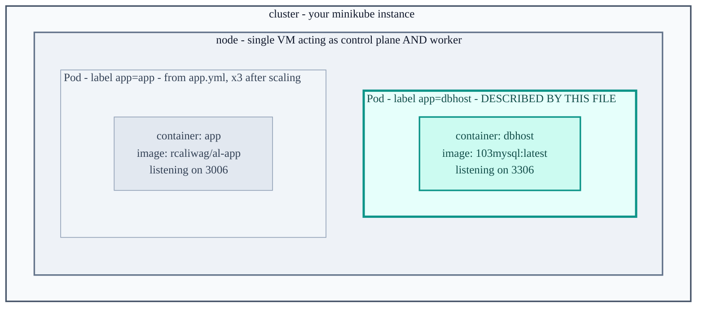
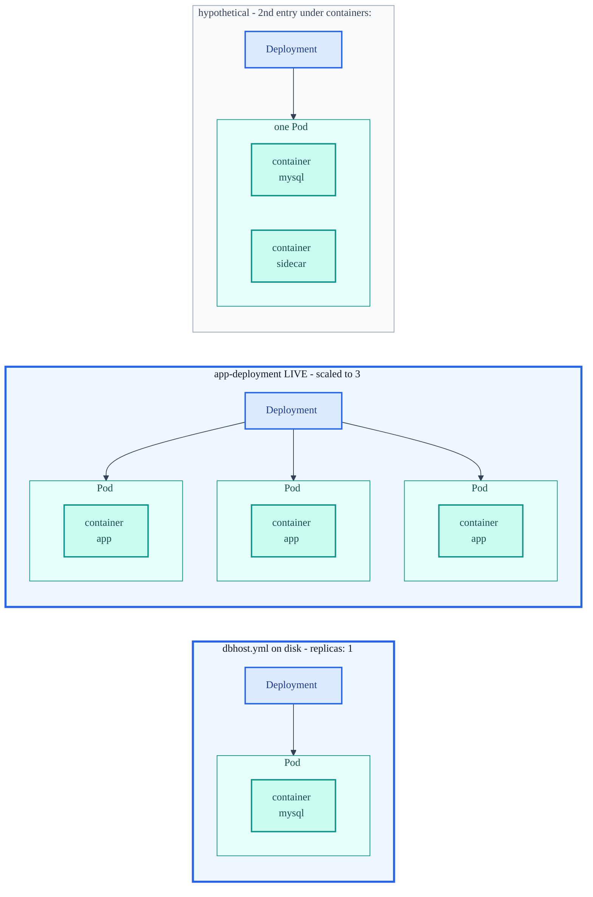
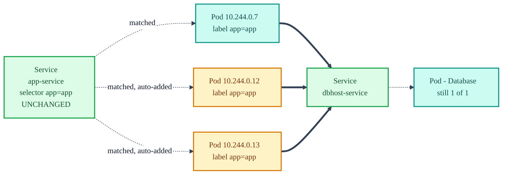
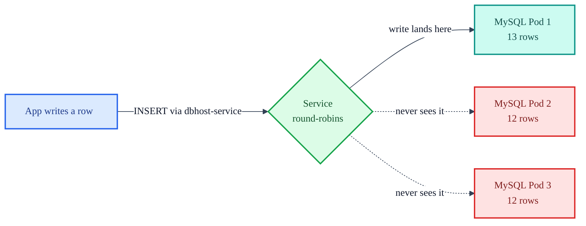
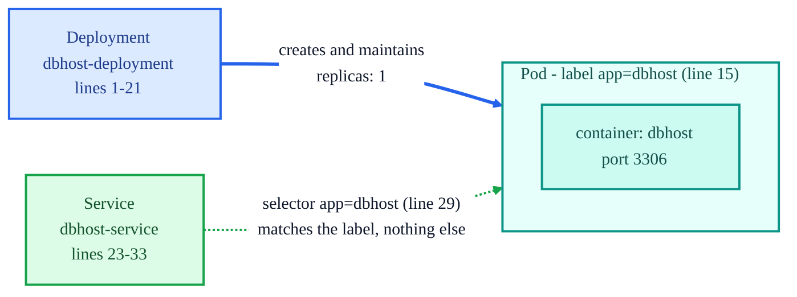
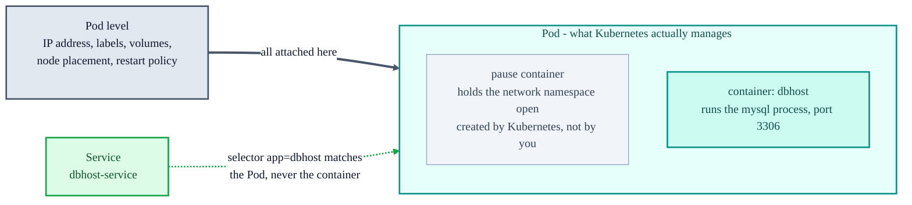

# Cluster, Pods, and Containers

Using `dbhost.yml` as the worked example. This one file contains all three levels nested inside
each other, and the nesting in the YAML is literally the nesting in reality.

## 1. The containment chain

Each level holds the one below it.



A cluster holds nodes, a node runs Pods, a Pod wraps one or more containers.

The node holds every Pod in the cluster, not just this one. `dbhost.yml` describes only the
highlighted Database Pod, which is why the rest of this document focuses on it. The App Pod beside
it comes from `app.yml` and is greyed out here to show it exists but is out of scope for this file.

## 2. Where each level lives in the file

```yaml
kind: Deployment          # line 2   NOT a level of the hierarchy, a controller
metadata:
  name: dbhost-deployment # line 4   names the Deployment
spec:
  replicas: 1             # line 8   how many PODS to create
  selector:
    matchLabels:
      app: dbhost         # line 11  which Pods this Deployment owns

  template:               # line 12  <-- everything below is the POD blueprint
    metadata:
      labels:
        app: dbhost       # line 15  label stamped onto each Pod created
    spec:
      containers:         # line 17  <-- everything below is INSIDE the Pod
      - name: dbhost      # line 18  the CONTAINER
        image: ...103mysql:latest    # line 19  what the container runs
        ports:
        - containerPort: 3306        # line 21  port the container listens on
```

Two boundaries matter:

- **Line 12, `template:`** Above it you are describing the Deployment. Below it you are describing
  a Pod.
- **Line 17, `containers:`** Below it you are describing what sits inside that Pod.

## 3. The part that trips people up

There are two `metadata:` and two `spec:` blocks in this single Deployment, at different indent
levels, describing different objects.

| Line | Block | Describes |
|------|-------|-----------|
| 3  | `metadata:` | the Deployment |
| 7  | `spec:`     | the Deployment's desired state |
| 13 | `metadata:` | each Pod |
| 16 | `spec:`     | each Pod's contents |

So `name: dbhost-deployment` on line 4 is the Deployment's name, while `name: dbhost` on line 18 is
the container's name. Different objects, similar-looking YAML.

## 4. What `replicas` actually multiplies

It multiplies **Pods**, not containers. The first two panels below are both real, and together they
are your cluster right now. `dbhost.yml` has `replicas: 1`, so there is one Database Pod holding one
mysql container. `app-deployment` was scaled to 3, so there are three App Pods each holding one app
container. Only the third panel is hypothetical, and it shows the thing `replicas` does not do.



Scaling to 3 produced three Pods each holding one container, not one Pod holding three. Multiple
containers in a single Pod come from adding another `- name:` entry under `containers:`, and you
would only do that for tightly coupled services. That is why the Database and the App each get their
own Pod rather than sharing one.

Current actual state of the cluster, **four** Pods:

```
NAME                                 READY   STATUS
app-deployment-c798454c8-fv5wp       1/1     Running
app-deployment-c798454c8-tbdkn       1/1     Running
app-deployment-c798454c8-wrxcd       1/1     Running
dbhost-deployment-67f4d4bb74-fvtd7   1/1     Running
```

That is not what the files on disk say. Both manifests still declare `replicas: 1`, so a fresh
`kubectl apply` of all four would drop you back to two Pods. See 4b.

### 4a. Observed: scaling the App to 3

Running this against the live cluster proved the middle panel:

```sh
kubectl scale --replicas=3 -f app.yml
```

```
NAME                READY   UP-TO-DATE   AVAILABLE   CONTAINERS   IMAGES
app-deployment      3/3     3            3           app          rcaliwag/al-app:v1
dbhost-deployment   1/1     1            1           dbhost       103mysql:latest
```

| Pod | IP | Age |
|---|---|---|
| `app-deployment-c798454c8-fv5wp` | 10.244.0.7 | 154m (original) |
| `app-deployment-c798454c8-tbdkn` | 10.244.0.12 | 4m (new) |
| `app-deployment-c798454c8-wrxcd` | 10.244.0.13 | 4m (new) |

Three Pods, each holding one container. Not one Pod holding three. The shared name prefix
`app-deployment-c798454c8-` is the ReplicaSet hash, so all three were stamped from the same Pod
template. The Database stayed at 1/1 and was untouched.

**The Service updated itself with no action taken.** `kubectl get endpoints app-service` went from
one entry to three:

```
app-service   10.244.0.12:3006,10.244.0.13:3006,10.244.0.7:3006
```



The Service was never edited and still does not know any Pod by name. The new Pods were born
carrying the label `app: app`, the selector matched them, and they joined the pool. Traffic now
load-balances across all three, and all three share the single Database through `dbhost-service`.
This is what the course means by abstracting connectivity away from specific Pods.

### 4b. The cluster and the file now disagree

`kubectl scale` is an **imperative** command. It changed live cluster state without touching the
manifest, so [app.yml](../app.yml) line 8 still reads `replicas: 1` while the cluster runs 3.

The next `kubectl apply -f app.yml` will quietly scale back down to 1, because apply enforces what
the file says. To make three stick, edit line 8 to `replicas: 3` and apply it. This gap between
imperative commands and declarative files is a common source of "why did my change disappear"
later on.

The course frames this same fact from the storage side ("How Kubernetes Stores and Applies
Configuration"): a change made with a direct command updates the configuration stored in etcd, and
a killed-and-restarted app comes back to that stored state, not to the `.yml` on disk. The full set
of live-editing commands is in [scaling-updates-rollbacks.md](scaling-updates-rollbacks.md).

### 4c. Scaling is safe for the App, not for the Database

`replicas` works cleanly for the **App** because it is stateless: every Pod runs the same image and
holds no data, so any Pod can serve any request and the Service load-balances across them freely.

The **Database** is different. Scaling `dbhost-deployment` to 3 does not give you one database with
three copies of the data. It gives you three independent MySQL Pods, each with its own container
filesystem and no shared storage, sitting behind one `dbhost-service`.



A write lands on whichever Pod the Service picks; the next read round-robins to a different Pod that
never saw it, so records appear to flicker in and out with no error in any log. They read as
consistent at first only because each Pod was seeded identically from the image at startup.

The course itself upscales the Database to 3 ("Upscaling the Database Instances") and a lesson later
edits it back down to 1, without flagging this hazard. Real database replication needs a
StatefulSet with stable identities, PersistentVolumeClaims for storage that outlives a Pod, and
MySQL's own primary/replica setup. A plain Deployment with `replicas: 3` gives none of that.

## 5. Two things in this file that are NOT in the containment chain



**The Deployment** does not contain the Pod, it creates and maintains it. Delete the Pod and the
Deployment notices and makes a new one. It is a controller sitting beside the hierarchy, watching it.

**The Service** does not contain anything either. It is a networking front door that finds Pods by
label. Line 29's `app: dbhost` matches line 15's `app: dbhost`, and that label match is the only
connection between the two halves of the file. The Service never mentions the Deployment or the Pod
by name.

## 6. Where is the cluster?

Nowhere in the file, and that is the point. You never write which node the Pod runs on. You hand
this manifest to the kube-apiserver, and kube-scheduler picks a node based on available resources.

On minikube there is only one node, so the choice is trivial. On the four-server setup from the
lesson, the same unchanged file would work and the scheduler would place the Pod for you.

## 7. Why wrap a single container in a Pod at all?

Because the container is not the thing Kubernetes manages. The Pod is. Almost everything Kubernetes
does operates on Pods, and a container by itself has nowhere to hang that information.



### The Pod owns what the container cannot

The label `app: dbhost` on line 15 is on the Pod, not the container. Containers have no labels at
all. Line 29's Service selector matches that Pod label, so without Pods the Service would have
nothing to point at. `replicas: 1` on line 8 counts Pods too. The whole label-and-selector mechanism
holding these manifests together is a Pod-level feature.

The Pod also holds the network identity. The Pod gets the IP address, not the container.
`containerPort: 3306` on line 21 is essentially documentation, since the port is really open on the
Pod's IP. That is why containers in the same Pod reach each other over `localhost` while containers
in different Pods need a Service. Volumes work the same way, declared at Pod level and mounted into
containers.

| Question | Answered by |
|---|---|
| What IP am I reachable at? | Pod |
| What node do I run on? | Pod |
| What labels identify me? | Pod |
| What storage do I mount? | Pod |
| What restarts when I crash? | Pod |
| What does `replicas` count? | Pod |
| What process actually executes? | container |

### Uniformity is the other half

With one abstraction, Kubernetes has a single scheduling path. The kube-scheduler places Pods, and
never needs a separate code path for "a lone container" versus "a group of containers". Neither do
Deployments, Services, or the dashboard. The single-container case is not a special case, it is just
a Pod whose container list has length one.

That also leaves room to grow. If you later added a logging agent or a proxy beside the app, it
would be a second entry under `containers:`, and the Pod's IP, labels, Service, and scheduling would
all stay exactly as they are. Nothing outside the file would change.

### The Pod already holds more than one container

Kubernetes silently runs an infrastructure container, the "pause" container, in every Pod. It does
nothing but hold the network namespace open, which is what lets the namespace and the IP survive
when the mysql container crashes and restarts. The Pod is a real, persistent thing that outlives the
containers inside it, which is exactly why it exists as its own concept.

Useful mental model: treat a Pod as a tiny logical host, and the containers inside it as processes
running on that host, sharing its network and its disks. A host running one process is still a
perfectly ordinary host.

---

See also: [architecture.md](architecture.md) for how the four manifests in this directory reference
each other, [kubernetes-architecture.md](kubernetes-architecture.md) for the control plane and
scheduler behind the node box, and [scaling-updates-rollbacks.md](scaling-updates-rollbacks.md) for
the commands that change replica counts and images on a live cluster.
