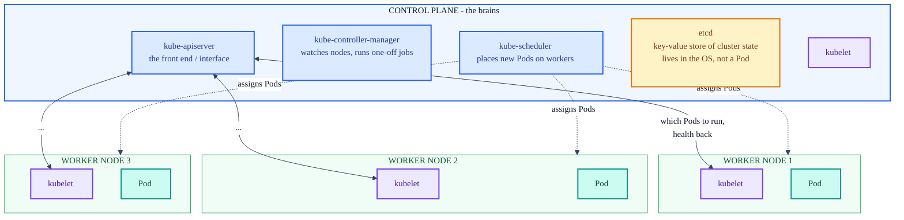

# Kubernetes Architecture: Control Plane, Workers, and minikube

The concepts behind the cluster the notes keep referring to. Lesson 1 explains what Kubernetes
is made of; Lesson 2 explains how minikube collapses all of it onto one machine.

## Why orchestration at all

Running one service across several servers solves CPU and memory limits but creates new problems:

- **Deployments get cumbersome.** The app needs tweaking per server, and the CI/CD pipeline grows
  more complicated.
- **Troubleshooting multiplies.** Four servers mean four sets of logs and error reports instead of
  one.
- **Network routing gets complex.** A load balancer has to be configured to spread traffic across
  the servers.

With Docker Compose the organization managed four `.yml` files by hand, one per server.
**Container orchestration** automates the provisioning, deployment, networking, and scaling of
containers so that work collapses back to a single configuration. Kubernetes is the orchestration
tool used here; it manages container deployments across a group of servers it controls, called a
**cluster**.

## The two kinds of node

A cluster is split into one control plane and some number of worker nodes.



- **Control plane**: the central management component. It dictates what the workers do. Kubernetes
  is installed here first.
- **Worker nodes** (often just "workers"): the servers that receive instructions from the control
  plane and actually run the Pods.

In the course scenario, three of four servers become workers and the fourth becomes the control
plane. Many production clusters run multiple control planes for redundancy; this project starts
with one.

## The four control-plane components

They install automatically with Kubernetes, so there is no extra setup. Three are services; the
last is a data store.

| Component | Kind | Responsibility |
|---|---|---|
| **kube-apiserver** | service | The front end. Every `kubectl` command goes through this interface to reach the control plane. |
| **kube-controller-manager** | service | Notices and responds when nodes go down; creates Pods for one-off jobs. |
| **kube-scheduler** | service | Watches for new Pods and allocates them to workers based on current load. |
| **etcd** | data store | A distributed key-value store holding all cluster data and state. Lives in the control plane's OS, not in a Pod. |

Two naming details the course leans on later:

- **Objects Kubernetes acts on are capitalized** (Pod, Service, Deployment). The `kube-*` services
  are *not* capitalized, because they act *on* objects rather than being acted upon.
- Each `kube-*` service itself runs in its own Pod, except etcd, which is a memory tool in the
  control plane's OS.

**etcd is why a cluster survives a restart.** State is written to etcd, so if the cluster shuts
down and restarts, the app comes back to the desired state recorded there, not to whatever a local
`.yml` file happens to say. This is the same fact the notes lean on elsewhere: imperative changes
persist because they land in etcd. See section 4b of
[cluster-pods-containers.md](cluster-pods-containers.md).

## kubelet ties it together

**kubelet** is the agent that lets the control plane and workers talk. It is installed on the
control plane at the same time as Kubernetes, then copied to and run on each worker.

- On each worker, kubelet receives which Pods it should run, monitors those Pods' health, and
  reports status back to the control plane.
- On the control plane, kubelet also manages the apiserver, scheduler, and controller-manager.
- With health data from every kubelet, kube-scheduler can decide which nodes have room for new
  Pods.

This is the same kubelet whose absence breaks everything in
[troubleshooting.md](troubleshooting.md) Issue 5: the apiserver, scheduler, controller-manager,
and etcd run as static Pods that kubelet starts, so when kubelet is down the whole control plane
stays `Exited`.

## The virtual network

Kubernetes lays a virtual network over all nodes so the cluster behaves as a single machine:

- **One error report** covering every node.
- **One IP address** for the cluster; individual nodes keep their own IPs but Kubernetes hides
  that.
- **One configuration file** to deploy the whole app.

Troubleshooting, networking, and deploying drop from four machines to one. What Kubernetes does
*not* solve is raw CPU and memory shortage; orchestration reallocates work, it does not create
capacity.

## minikube: the whole cluster on one machine

An **emulator** lets one system (the host) imitate another (the guest). **minikube** is a
Kubernetes emulator: it runs a one-node cluster where the single node acts as control plane and
worker at once. That is exactly what `kubectl get nodes -o wide` shows in this project, one node
named `minikube` with the `control-plane` role.

Core setup commands (Lesson 2):

```sh
minikube start            # create/boot the cluster, applies baseline config
minikube status           # host / kubelet / apiserver / kubeconfig state
kubectl get node          # node should read STATUS = Ready
minikube dashboard --url  # browser UI for the cluster
```

Two setup gotchas from the course:

- **Disable Docker Content Trust first.** minikube will not start cleanly with DCT enabled. On
  Windows, if `set` shows `DOCKER_CONTENT_TRUST`, clear it with `set DOCKER_CONTENT_TRUST=`
  (Mac: `unset DOCKER_CONTENT_TRUST`). If the variable is undefined, there is nothing to do.
- **Docker must be running** for any of these commands to work, and the course notes administrator
  rights are required.

`kubectl` is the command-line tool that talks to the kube-apiserver. It is pointed at the local
minikube instance here but can be configured against any Kubernetes cluster. How it finds the
apiserver (and how that breaks on a container restart) is covered in
[troubleshooting.md](troubleshooting.md) Issues 4 and 5.

## How this maps to the rest of the notes

- The single minikube node is the "node" box in
  [cluster-pods-containers.md](cluster-pods-containers.md) section 1.
- kube-scheduler placing Pods is why no manifest ever names a node
  ([cluster-pods-containers.md](cluster-pods-containers.md) section 6).
- etcd holding state is why scaling survives until an `apply` overwrites it
  ([cluster-pods-containers.md](cluster-pods-containers.md) section 4b).

---

See also: [cluster-pods-containers.md](cluster-pods-containers.md) for the Pod and container
hierarchy, [architecture.md](architecture.md) for how the manifests reference each other, and
[troubleshooting.md](troubleshooting.md) for what happens when the control plane or kubelet stops.
