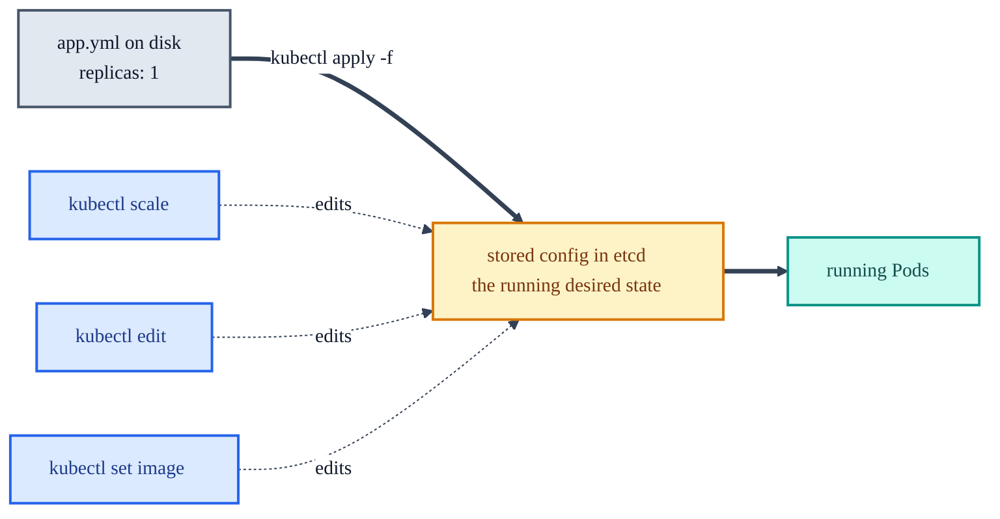
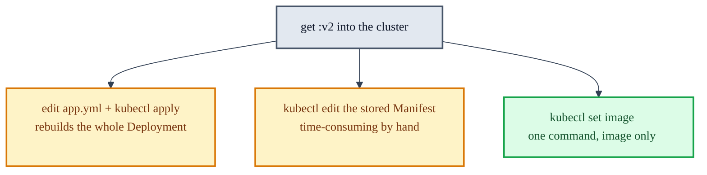

# Scaling, Updates, and Rollbacks with kubectl

The live-management operations from Lessons 4 and 5: changing how many Pods run, swapping the
image with no downtime, undoing a bad change, and spinning up a throwaway Pod. All of these act on
the configuration Kubernetes stores in etcd, not on the `.yml` files on disk.

## Where changes actually live

When a Deployment Manifest is applied, Kubernetes reads the `.yml`, stores the configuration in
etcd, and runs the app from that stored copy. Every command below edits the **stored** copy.



This is the **imperative vs declarative** split. `kubectl apply -f` is declarative: the file is the
source of truth and apply makes the cluster match it. `kubectl scale / edit / set image` are
imperative: they change the live state directly. The catch is that the two can drift, and the next
`apply` wins. See section 4b of [cluster-pods-containers.md](cluster-pods-containers.md).

When to edit stored config directly instead of changing the file and re-applying:

- **Several changes at once.** A CLI runs one imperative command at a time; `kubectl edit` opens
  the whole manifest.
- **The files are not on this machine.** You can configure the cluster from a box that never had
  the local `.yml` files.

When *not* to: if new local files already match the running state, a couple of `apply` commands are
faster than hand-editing stored config.

## Scaling: change the Pod count

```sh
kubectl scale --replicas=<number> -f <filename>.yml
kubectl scale --replicas=3 -f app.yml       # three App Pods
```

Returns `deployment.apps/app-deployment scaled`. If an extra `Error from server` line also appears,
the course says to ignore it at this stage. Verify with `kubectl get all` or `kubectl get pods`.

Scaling multiplies **Pods**, never containers, and the Service picks up the new Pods automatically
by label. That whole mechanic, with the live endpoint output, is worked through in section 4 of
[cluster-pods-containers.md](cluster-pods-containers.md).

> Stateful caution: scaling a **stateless** service like the App is safe, since any Pod can serve
> any request. Scaling the **Database** to 3 gives three independent MySQL Pods behind one Service
> with no shared storage, so writes land on whichever Pod the Service picks and reads flicker. The
> course upscales the Database to 3 and later scales it back to 1 without flagging this. See the
> stateful-scaling subsection in [cluster-pods-containers.md](cluster-pods-containers.md).

## Editing stored config with `kubectl edit`

`kubectl edit` opens the stored manifest in a text editor. On Windows that is Notepad by default,
which works well. On Mac it opens in `vi` unless you set `export KUBE_EDITOR="nano"`.

Scale the App back from 3 to 2 by editing:

```sh
kubectl edit deployments/app-deployment
```

- The manifest that opens is the applied `app.yml`, but with many Kubernetes defaults filled in
  explicitly.
- Change `replicas:` in the **`spec:`** section (not the `availableReplicas:` field in `status:`,
  which only reports how many are currently running).
- Save: on Windows, File > Save then close Notepad; on Mac, `Ctrl+x`, `y`, Enter.
- Success prints `deployment.apps/app-deployment edited`. If it says
  `dbhost-deployment edited` instead, the wrong service was opened.

Other things editable here besides `replicas:` include `name:` and `labels:`.

## Rolling updates: change the image with no downtime

A **rolling update** upgrades a service to a newer image by gradually replacing old-version Pods
with new-version ones, so the app never goes fully down. Scaling is *not* a rolling update: adding
Pods does not change the image version running inside any of them.

Three ways to get a new `:v2` image into Kubernetes:



`set image` is the lightest: it changes only the live image, touching no other config.

```sh
kubectl set image deployment/app-deployment app=quanticschoolofbusiness/al-app:v2
```

- Output: `deployment.apps/app-deployment image updated`.
- Watch progress with `kubectl get deployment/app-deployment`; the `UP-TO-DATE` column shows how
  many Pods carry the new image. Repeat until it matches the replica count.
- Hard-refresh the browser: `al-app:v2` changes the background from white to yellow.
- `deployment/` and `deployments/` are both accepted; kubectl does not care about the plural.

Note the command shape: the three keywords are `kubectl set image`, followed by
`<resource> <container>=<image>`. The `<container>` key matters, covered next.

## The same for the Database, and why the container key matters

```sh
kubectl set image deployment/dbhost-deployment dbhost=quanticschoolofbusiness/al-dbhost:v2
```

`al-dbhost:v2` swaps the database contents; refresh the app and the list now shows ice cream
flavors. Using `app=...al-dbhost:v2` here would try to update a container named `app` inside the
Database Pod, which is the wrong target. The key before `=` is the **container name** from the Pod
template, so it must be `dbhost` for the Database and `app` for the App.

If the app errors right after the swap, the new database Pod is still initializing; keep
refreshing.

## Rollbacks: undo a bad version

Kubernetes retains the rollout history of each service, so a rollback is one command and does not
require the old files.

```sh
kubectl rollout undo deployment/app-deployment      # App back to previous image (yellow -> white)
kubectl rollout undo deployment/dbhost-deployment   # Database back to previous image
```

Output: `deployment.apps/app-deployment rolled back`. As a heavier fallback,
`kubectl apply -f .` in the Kubernetes directory restores the initial state from the files, but it
does not use the retained rollout history and is slower.

## Ad-hoc Pods: run one without a manifest

Kubernetes can run a Pod with no configuration file, handy for a quick test or debug Pod.

```sh
kubectl run -it ubuntu --image=ubuntu:latest   # -it attaches the CLI to the new Pod
hostname                                        # returns "ubuntu", confirming you are inside it
exit                                            # leaves the session WITHOUT deleting the Pod
kubectl get pods/ubuntu                         # still there after exit
kubectl delete pod ubuntu --now                 # stops AND removes it
```

`exit` ends only the CLI session; the Pod keeps running until `kubectl delete`. Use ad-hoc Pods for
short-lived testing or debugging. Anything permanent or demanding should have real configuration
files, since undefined Pods have very limited functionality.

## Command summary

| Task | Command |
|---|---|
| Scale a service | `kubectl scale --replicas=N -f <file>.yml` |
| Edit stored config | `kubectl edit deployment/<name>` |
| Rolling image update | `kubectl set image deployment/<name> <container>=<image>:v2` |
| Check update progress | `kubectl get deployment/<name>` (watch `UP-TO-DATE`) |
| Roll back one version | `kubectl rollout undo deployment/<name>` |
| Restore from files | `kubectl apply -f .` |
| Throwaway Pod | `kubectl run -it <name> --image=<image>` |
| Remove a Pod | `kubectl delete pod <name> --now` |

---

See also: [cluster-pods-containers.md](cluster-pods-containers.md) for what scaling multiplies and
the imperative/declarative drift, [viewing-logs.md](viewing-logs.md) for checking Pod health after
a change, and [troubleshooting.md](troubleshooting.md) for the image-cache trap when reusing a tag.
