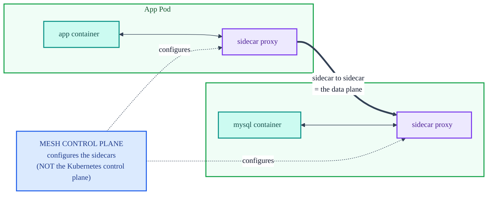
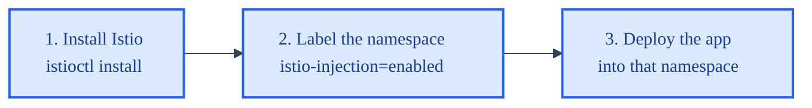

# Service Mesh Concepts and Istio

Lessons 6 and 7. A service mesh is an infrastructure layer that controls and monitors the
communication *between* services in a cluster. Lesson 6 is the concept; Lesson 7 installs Istio and
the Kiali dashboard.

> This is **Part 11** material. The mesh lesson redeploys the app from `Part11/Kubernetes`, which
> adds a Redis Pod on top of the App and Database. The prep step (allocating more RAM, deleting and
> recreating the cluster) is [troubleshooting.md](troubleshooting.md) Issue 6.

## Why a mesh at all

With two services the app barely needs one. But an app with dozens of microservices can pass
hundreds or thousands of internal messages per second, and tracking that communication by hand
becomes impossible, which invites inefficiency and unmonitored, unsafe traffic.

A service mesh **abstracts communication away from the services** so they talk through the mesh
rather than directly to each other. Reasons to do that:

- **Let each service focus on its own job.** Time a service spends on networking is time not spent
  on its actual task.
- **Control how data travels.** The Service objects told Pods how to reach each other, but nothing
  yet *monitors* the flow. The mesh does.
- **Add a security layer.** If you cannot trace data's path, you cannot vouch for its safety.

The mesh manages ingress and egress for every Pod, making inter-Pod communication more reliable and
better routed, at the cost of one extra processing layer.

## Sidecars do the work

A mesh works by injecting a **sidecar** into each Pod: a proxy container that runs alongside the
service container and sits in its inbound and outbound paths. Data leaving a Pod exits through its
sidecar, travels sidecar to sidecar, and enters the destination Pod through *its* sidecar. Every
service container ends up proxied by a sidecar.

The division of labor: the **service** works on application data; the **service mesh** discovers new
service Pods, encrypts/decrypts traffic, and authenticates/authorizes requests. The mesh moves and
monitors data but never acts on it.



## Two planes: data and control

A mesh has two parts, and the naming collides with Kubernetes, so keep them straight:

- **Data plane**: the collection of sidecar proxies. It directs all intra-cluster traffic and
  touches every packet, handling authentication/authorization, encryption, and discovery. In the
  course graphic the Pods are red and the data plane is blue, so the sidecars, being both, are drawn
  purple.
- **Control plane**: the interface for defining mesh configuration, which it then applies to the
  data plane and uses to oversee the sidecars. The data plane *encrypts*; the control plane
  *configures how* it encrypts. Data planes are configured but are not where configuration is
  defined.

**This mesh control plane is not the Kubernetes control plane.** The Kubernetes control plane
oversees worker nodes (see [kubernetes-architecture.md](kubernetes-architecture.md)); the mesh
control plane is mesh-specific.

The elegant part: the cluster is practically unaware the mesh exists. Sidecars route according to
the same Service objects already applied. So beyond the initial install, **no new Service objects or
app-code changes are needed**. A service cannot be configured to interact with something it cannot
detect, and that is exactly why nothing has to be reconfigured.

## The four golden signals

As data moves Pod to Pod, sidecars log it, and those logs feed the metrics a mesh is prized for:

| Signal | What it measures |
|---|---|
| **Latency** | Time to transfer a request between sidecars. A baseline; a spike is an early warning. |
| **Traffic** | Total requests moving into, out of, and within the mesh. |
| **Errors** | Failed requests. A missing sidecar receipt shows exactly where data was dropped. |
| **Saturation** | Resources in use, so how much more the cluster can take. |

Beyond observing, a mesh can be configured (at the control plane, applied to the sidecars) to act:
build in retry patterns, eject unhealthy containers, and remediate latency automatically.

## Installing Istio

The chosen open-source mesh is **Istio**. After the RAM/recreate prep (Issue 6), install it into
the cluster:

```sh
# macOS / Linux
curl -L https://istio.io/downloadIstio | sh -
./istioctl install --set profile=demo -y

# Windows: clone the repo, drop istioctl.exe into istio\bin, then from that folder
.\istioctl install --set profile=demo -y
```

Five checkmarks and "Installation complete" mean success.

## Namespaces and the injection label

Installing Istio adds a **namespace**, a virtual sub-cluster used to isolate and identify resources
by name. Istio's components live in `istio-system`, kept separate from the app just for tidiness.
Namespaces do not wall Pods off from each other; Pods in the same cluster can still interact across
namespaces.

```sh
kubectl get namespace          # istio-system now present
```

Enabling the mesh for the app is a **three-step process**:



```sh
kubectl apply -f .                                        # from Part11/Kubernetes; adds Redis too
kubectl label namespace default istio-injection=enabled   # -> namespace/default labeled
kubectl get ns --show-labels                              # label shows in the rightmost column
```

## Watching the sidecars appear

Right after deploying, each Pod runs a single container:

```sh
kubectl -n default get pods
# App, Database, Redis: READY shows 1/1 each, three containers total
```

The label alone does nothing to existing Pods; they have to be recreated so Istio can inject the
sidecar. Delete and redeploy:

```sh
kubectl delete -f .    # the "." is all of them, NOT the whole cluster
kubectl apply -f .
kubectl -n default get pods
# now READY shows 2/2 each: app + sidecar, mysql + sidecar, redis + sidecar
# six containers total across three Pods
```

No scale command, no edited manifest. The Pods gained a container purely because they were deployed
into a namespace carrying `istio-injection=enabled`. This is the multi-container Pod case that
[cluster-pods-containers.md](cluster-pods-containers.md) section 4 describes as hypothetical, now
real, and the reason [troubleshooting.md](troubleshooting.md) Issue 6 said the cluster suddenly
needs more memory.

## The Kiali dashboard

Kiali visualizes the mesh. Install the addons and give it a port:

```sh
kubectl apply -f samples/addons                       # from the istio directory
minikube service app-service --url                    # open the app, submit a few orders
kubectl port-forward svc/kiali -n istio-system 20001  # then open the Kiali URL
```

Submit orders, refresh Kiali (blue refresh icon, top-right), and change "Last 2m" to "Last 7d" to
see history. The graph draws circles for microservices and triangles for the Kubernetes Services;
traffic flows left to right, with the app service calling both `dbhost` and `redis`. An empty graph
just means no recent traffic, so submit a few more orders.

What Kiali offers, under **Applications** and **Workloads**:

- Per-container logs (Workloads > App Deployment > Logs), filterable between app logs and
  sidecar-proxy logs.
- Inbound/outbound metrics (request volume, duration, size).
- The connection path between services (Traffic Graph), invaluable once an app has hundreds of
  services.

What it does **not** show: app-specific data like the number of rows in the MySQL database. Kiali
reports on health and connectivity, not application contents. And seeing which Pods are healthy is
not unique to Kiali; a plain `kubectl get pods` already shows `READY` and status.

## Recap

- A mesh directs intra-cluster traffic while adding monitoring and security, with **no app-code
  changes**.
- Security, fault tolerance, monitoring, and traffic management layer onto a microservices app for
  free once the mesh is in place.
- Kubernetes knows where to inject sidecars purely from the `istio-injection=enabled` namespace
  label. Give the mesh a namespace and it does the rest.

---

See also: [troubleshooting.md](troubleshooting.md) Issue 6 for the memory and cluster-recreate prep,
[cluster-pods-containers.md](cluster-pods-containers.md) for the multi-container Pod concept, and
[kubernetes-architecture.md](kubernetes-architecture.md) for the Kubernetes control plane the mesh
control plane is often confused with.
