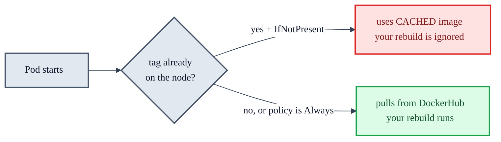
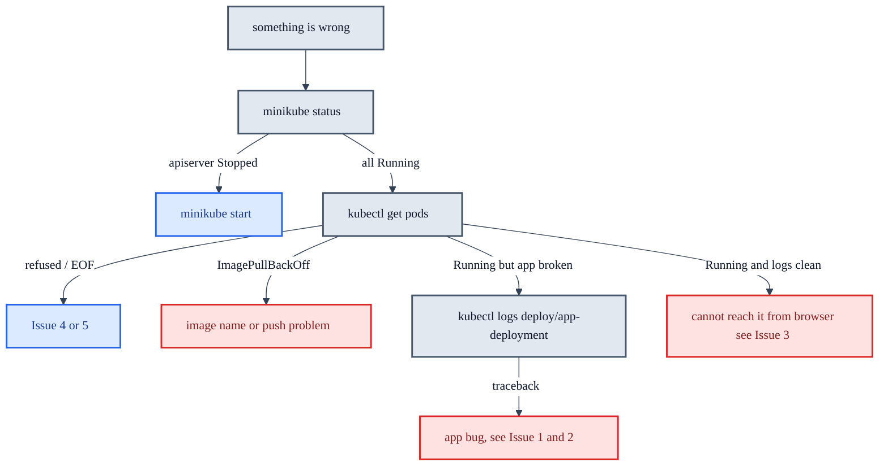

# Troubleshooting Log: Part 9 Deployment

Real problems hit while deploying this directory to minikube on Windows, with the working fixes.
Recorded in the order they appeared.

## Quick reference

| Symptom | Real cause | Fix |
|---|---|---|
| Page returns HTTP 500 | `dbconnect.py` hardcoded `host='dbhost'`, ignoring `DB_HOST` | Edit to `host=db_host`, rebuild, push |
| Browser times out on `192.168.49.2:30000` | Docker driver on Windows, node IP not routable from host | `minikube service app-service --url` |
| Rebuilt image has no effect | `imagePullPolicy: IfNotPresent` + tag already cached on the node | `imagePullPolicy: Always`, or force-untag |
| `minikube image rm` fails with "must force" | Running containers reference the image | `minikube ssh -- docker rmi -f <image>` |
| `kubectl`: connection **refused** | Container restarted, kubeconfig points at the old published port | `minikube update-context` |
| `kubectl`: **EOF** | Port is right but the apiserver is not running | `minikube start` |
| `MK_USAGE: Docker Desktop has only NNNNMB` | WSL2 backend caps Docker at ~50% of host RAM | Create `.wslconfig`, `wsl --shutdown` |
| `kubectl` dials `localhost:8080`, no contexts | The cluster was deleted | Recreate, then re-apply all manifests |

---

## Issue 1: App returned HTTP 500 on every request

The Pods were `Running 1/1` and the Service had correct endpoints, so Kubernetes was healthy. The
failure was in the application image.

```
File "/app/dbconnect.py", line 10, in connection
  conn = mysql.connector.connect( host='dbhost',
mysql.connector.errors.DatabaseError: 2005 (HY000): Unknown MySQL server host 'dbhost' (-5)
```

Proof of cause, run inside the App Pod:

```
DB_HOST env from ConfigMap: dbhost-service
  dbhost         -> FAILS: gaierror [Errno -3] Temporary failure in name resolution
  dbhost-service -> 10.96.213.52
```

The ConfigMap wiring was perfect. `DB_HOST` arrived in the container and the image ignored it,
using a hostname that does not exist as a Service. See `architecture.md` for why the name must
match `metadata.name` in `dbhost.yml`.

**Fix** in `Part9/app/dbconnect.py`, which is the lesson's first activity:

```diff
+db_host = os.environ['DB_HOST']
 db_name = os.environ['DB_NAME']
-    conn = mysql.connector.connect( host='dbhost',
+    conn = mysql.connector.connect( host=db_host,
```

A code fix alone changes nothing until the image is rebuilt, pushed, and actually re-pulled. That
last part is Issue 2.

---

## Issue 2: Rebuilding the image had no effect

Because the tag is not `:latest`, Kubernetes defaults to `imagePullPolicy: IfNotPresent`. The node
already had the tag cached, so it never contacted DockerHub, no matter how many times the Deployment
was restarted.

Confirm what the node is holding:

```sh
kubectl get node minikube -o json | ConvertFrom-Json | ForEach-Object { $_.status.images } |
  Where-Object { $_.names -match 'al-app' } | ForEach-Object { $_.names -join ' , ' }
```

```
rcaliwag/al-app@sha256:bb0f2d18110995338c76f02cf2587d443f66d4858bd5040dc4678aa52631d05e ,
rcaliwag/al-app:v1
```



### Option A: always pull (recommended for a tag you overwrite)

One-time edit to `app.yml`:

```yaml
      - name: app
        image: rcaliwag/al-app:v1
        imagePullPolicy: Always
```

Then every rebuild is just:

```sh
docker build -t rcaliwag/al-app:v1 .
docker push rcaliwag/al-app:v1
kubectl rollout restart deployment app-deployment
```

Build and push **before** applying or restarting, otherwise you pull the image you have not replaced
yet. The kubelet re-checks the registry digest on every Pod start, so the new image is picked up.

> Caution: `kubectl apply -f app.yml` enforces the whole file. Line 8 still says `replicas: 1`, so
> applying scales a 3-replica cluster back down to 1. Set `replicas: 3` in the file first if you
> want three to survive. See section 4b of `cluster-pods-containers.md`.

### Option B: evict the cached tag (no manifest change)

```sh
docker build -t rcaliwag/al-app:v1 .
docker push rcaliwag/al-app:v1
minikube ssh -- docker rmi -f rcaliwag/al-app:v1
kubectl rollout restart deployment app-deployment
```

Repeat the `rmi` on every single rebuild. That is the cost of leaving the manifest alone.

### Script fixes made along the way

**`minikube image rm` does not work here.**

```
! Failed to remove images for profile minikube
Error response from daemon: conflict: unable to remove repository reference
"rcaliwag/al-app:v1" (must force) - container 9e1cfe39cc49 is using its referenced image
```

Docker refuses to delete an image that a container references, and the Deployment keeps Pods
running. Docker has no objection to *untagging*, which is all that is needed, since
`IfNotPresent` looks up the tag:

```diff
-minikube image rm rcaliwag/al-app:v1
+minikube ssh -- docker rmi -f rcaliwag/al-app:v1
```

**`minikube stop` does not clear the cache.** The image lives on the node's disk and survives
stop/start. On restart the kubelet recreates the Pods, `IfNotPresent` finds the same stale tag, and
you are back where you started. Only `minikube delete` wipes it, and that destroys both Deployments,
both Services, the ConfigMap, the Secret, and any scaling.

### How the course avoids this entirely

This whole issue came from rebuilding and reusing the **same** tag (`rcaliwag/al-app:v1`). The
course's update lesson never does that. It ships a pre-built **new** tag from a different repo
(`quanticschoolofbusiness/al-app:v2`) and rolls it out with `kubectl set image`. A tag the node has
never seen has nothing to hit in the cache, so `IfNotPresent` pulls it fresh. Bumping the tag is the
clean path; reusing a tag is what forces the workarounds above. The rolling-update commands are in
[scaling-updates-rollbacks.md](scaling-updates-rollbacks.md).

---

## Issue 3: Browser times out on the node IP

The course says to browse `http://192.168.49.2:30000`. That works on drivers where the node gets a
host-visible IP, such as Hyper-V or VirtualBox, or Docker on native Linux.

Check what you are actually running:

```sh
kubectl get nodes -o wide
```

```
CONTAINER-RUNTIME   docker://29.2.1
KERNEL-VERSION      6.18.33.1-microsoft-standard-WSL2
```

With the Docker driver on Windows, the node is a container inside the WSL2 VM and `192.168.49.2` is
an address on Docker's internal bridge in there. Windows has no route to that subnet, so the browser
times out rather than being refused. minikube confirms this itself:

```
! Because you are using a Docker driver on windows, the terminal needs to be open to run it.
```

**Fix,** leaving the terminal open while browsing:

```sh
minikube service app-service --url      # prints http://127.0.0.1:<random-port>
```

or, to control the port and match the course URL:

```sh
kubectl port-forward service/app-service 3006:3006    # then http://localhost:3006
```

The tunnel port changes every time, and the tunnel dies if the minikube container restarts.

---

## Issue 4: kubectl "connection refused"

```
Unable to connect to the server: dial tcp 127.0.0.1:58553:
connectex: No connection could be made because the target machine actively refused it.
```

`kubectl` is an HTTPS client for the kube-apiserver. The address and credentials come from
`C:\Users\<you>\.kube\config`, which is why no command ever mentions a port. Compare what kubectl
believes against what Docker publishes:

```sh
kubectl config view --minify -o jsonpath="{.clusters[0].cluster.server}"   # https://127.0.0.1:58553
docker port minikube 8443                                                  # 127.0.0.1:57355
```

When the minikube container restarts, Docker assigns fresh random host ports, and the kubeconfig
still holds the old one. Nothing listens there, so the connection is refused instantly.

```sh
minikube update-context
```

That rewrites the `server:` line only. It does not touch the cluster.

Worth understanding: `minikube ssh` kept working through all of this because the minikube CLI asks
Docker for the node's *current* port mapping on every run, while kubectl trusts a static file
written once. The CLI follows the container, kubectl does not.

---

## Issue 5: kubectl "EOF"

```
couldn't get current server API group list: Get "https://127.0.0.1:57355/api?timeout=32s": EOF
Unable to connect to the server: EOF
```

Different failure from Issue 4, and the distinction is diagnostic:

- **refused** means nothing is listening on that host port. Wrong port, see Issue 4.
- **EOF** means the port is right, Docker's proxy accepted the connection, then found nothing
  listening on 8443 inside the container and hung up. The apiserver itself is down.

What was actually wrong inside the node:

```sh
docker exec minikube systemctl is-active kubelet     # inactive
docker exec minikube systemctl is-enabled kubelet    # disabled
```

The apiserver, etcd, scheduler, and controller-manager are static Pods that **kubelet** starts. With
kubelet dead, all four stayed `Exited` and nothing restarted them. minikube deliberately leaves
kubelet disabled at boot and starts it during `minikube start`, so a Docker Desktop or WSL restart
brings the container back **without** Kubernetes running on it.

```sh
minikube start
```

This starts kubelet, restores the control plane, and refreshes the kubeconfig port in one step.
Nothing is lost: Deployments, Services, the ConfigMap, the Secret, and replica counts all live in
etcd on the node's disk.

**Check `minikube status` first whenever kubectl acts strange.** It would have shown this instantly
and skipped the whole detour:

```
kubelet: Stopped
apiserver: Stopped
```

---

## Issue 6: not enough memory to recreate the cluster for Istio

The Istio lesson requires a bigger cluster, so it instructs you to destroy and recreate:

```sh
minikube delete
minikube start --memory=16384 --cpus=4
```

The delete is mandatory, not optional. `--memory` and `--cpus` are only read when a cluster is
**created**. Passing them to a `minikube start` against an existing profile does nothing.

The recreate then failed:

```
X Exiting due to MK_USAGE: Docker Desktop has only 15658MB memory but you specified 16384MB
```

### Cause

Docker Desktop on the WSL2 backend defaults to roughly **half** the host's RAM. On a 32GB machine
that is the 15658MB reported, which is just under the 16384MB requested.

There is no memory slider in Docker Desktop's Settings for the WSL2 backend. That control only
exists on the Hyper-V backend. The limit lives in a WSL config file instead, which is the part that
sends people hunting through the UI for a setting that is not there.

### Fix

Create `C:\Users\<you>\.wslconfig`:

```ini
[wsl2]
memory=24GB
processors=8
```

This is a ceiling, not a reservation. WSL2 allocates on demand and returns memory, so Windows keeps
its headroom. Do not assign all of it. On 32GB, leaving 8GB for Windows is sensible.

```sh
wsl --shutdown
```

Then restart Docker Desktop. The shutdown is what forces the new limit to be read, and Docker
Desktop will not pick it up without a full VM restart.

Verify before retrying:

```sh
docker info --format "{{.MemTotal}}"      # want > 17179869184 (16GB in bytes)
```

If it still reports about 15.6GB, the VM did not fully restart. Exit Docker Desktop completely,
tray icon included, run `wsl --shutdown` again, then start it.

To undo any of this, delete the `.wslconfig` file.

### Recognising a deleted cluster

After `minikube delete`, these are the symptoms, and both are expected rather than broken:

```sh
docker ps -a --filter "name=minikube"     # no rows, the container is gone entirely
kubectl config get-contexts               # empty table, no contexts at all
```

With no context, kubectl falls back to its default of `http://localhost:8080` and reports connection
refused. That default is the giveaway that the kubeconfig has no cluster, as distinct from Issue 4,
where the kubeconfig has a cluster at a stale port.

`minikube delete` removes the container **and** the kubeconfig entry. Contrast with `minikube stop`,
which leaves both in place.

### Recovery

Nothing is lost, because everything in the cluster was created from files that are still on disk:

```sh
minikube start --memory=16384 --cpus=4
kubectl apply -f dbhost-config.yml
kubectl apply -f dbhost-secret.yml
kubectl apply -f dbhost.yml
kubectl apply -f app.yml
```

Run these from `Part9\Kubernetes`, not from `notes\`. The App Pod pulls `al-app:v1` fresh from
DockerHub, so the fixed `dbconnect.py` arrives automatically and there is no cache to fight.

This is the real payoff of declarative configuration. The cluster was disposable the whole time.

One side effect worth noticing: any imperative changes made with `kubectl scale` or `kubectl edit`
are gone, because they only ever lived in etcd. Both manifests declare `replicas: 1`, so you come
back with exactly one App Pod and one Database Pod. See section 4b of
[cluster-pods-containers.md](cluster-pods-containers.md).

### What changes once Istio is installed

A service mesh injects an Envoy sidecar container into every Pod. Pods go from one container to two,
and `kubectl get pods` starts reporting `2/2` instead of `1/1`. That is the multi-container Pod case
from section 4 of the notes appearing for real, and it is also why the cluster suddenly needs more
memory: every Pod now runs an extra proxy. The full mesh story (Istio install, the injection label,
Kiali) is in [service-mesh-istio.md](service-mesh-istio.md).

---

## Verification after any image change

Confirm the new code is actually inside the running container, not just on your disk:

```sh
kubectl exec deploy/app-deployment -- head -6 /app/dbconnect.py
```

```
db_host = os.environ['DB_HOST']      <- must be present
```

Then exercise the database path without needing a browser or tunnel:

```sh
kubectl exec deploy/app-deployment -- python -c "import urllib.request; r=urllib.request.urlopen('http://localhost:3006', timeout=10); print('HTTP', r.status)"
```

`HTTP 200` means App to Service to DNS to Database all work. `HTTP 500` means the app is up but the
database call fails, so read the logs. A timeout means the app is not serving at all.

---

## Diagnostic order



---

See also: [architecture.md](architecture.md) for how the manifests reference each other,
[cluster-pods-containers.md](cluster-pods-containers.md) for the Pod and container hierarchy,
[viewing-logs.md](viewing-logs.md) for reading logs across multiple replicas,
[kubernetes-architecture.md](kubernetes-architecture.md) for the kubelet and control plane behind
Issues 4 and 5, and [service-mesh-istio.md](service-mesh-istio.md) for the Istio work Issue 6
prepares for.
