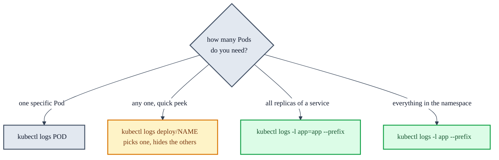

# Reading Logs Across Multiple Pods

Once a Deployment has more than one replica, `kubectl logs` gets a lot less obvious. These are the
flags that matter, with the traps that cost time.

## Quick reference

| Goal | Command |
|---|---|
| One Pod | `kubectl logs <pod>` |
| One Pod of a Deployment | `kubectl logs deploy/app-deployment` |
| **All replicas of the App** | `kubectl logs -l app=app --prefix --tail=100` |
| **Every Pod, App and Database** | `kubectl logs -l app --prefix --tail=20` |
| Follow live | `kubectl logs -l app=app --prefix -f` |
| Only the last 5 minutes | `kubectl logs -l app=app --prefix --since=5m` |
| Logs from before a crash | `kubectl logs <pod> --previous` |
| With timestamps | `kubectl logs -l app=app --prefix --timestamps` |
| More than 5 Pods | add `--max-log-requests=10` |

It is `logs`, not `log`. `kubectl log` errors out with a "Did you mean this?" suggestion.

## Why `deploy/` is not enough

```sh
kubectl logs deploy/app-deployment
```

```
Found 2 pods, using pod/app-deployment-556976699d-fv5wp
```

It picks **one** Pod and ignores the rest. With replicas, that means you can read a perfectly clean
log while the actual failure sits on a Pod you never looked at. Use a label selector instead.

The course writes this command as `kubectl logs deployment.app/app-deployment` (and the Database as
`kubectl logs deployment.app/dbhost-deployment`). The resource prefix is interchangeable:
`deploy/`, `deployment/`, `deployment.app/`, and `deployment.apps/` all resolve to the same
Deployment, so the spelling is a matter of taste.



## `--prefix` is what makes multi-Pod output readable

Without it, lines from every Pod are concatenated with nothing marking the boundaries. With it:

```sh
kubectl logs -l app=app --prefix --tail=3
```

```
[pod/app-deployment-556976699d-zwtbf/app]  * Debugger is active!
[pod/app-deployment-556976699d-zwtbf/app]  * Debugger PIN: 618-483-601
[pod/app-deployment-556976699d-sxflv/app] 10.244.0.1 - - [20/Jul/2026 07:06:29] "GET / HTTP/1.1" 200 -
[pod/app-deployment-556976699d-sxflv/app] 127.0.0.1 - - [20/Jul/2026 07:06:31] "GET / HTTP/1.1" 200 -
```

The format is `[pod/<pod-name>/<container-name>]`. The container name matters once a Pod runs more
than one container.

The course reaches for the same flag: it uses `kubectl logs -l app=app --prefix` when scaling back
the App and notes that logs give far more information than `kubectl get pods` status alone.

## Selecting every Pod with `-l app`

Both Deployments in this project label their Pods with the **key** `app`, at different values:

- `app: app` from `app.yml` line 15
- `app: dbhost` from `dbhost.yml` line 15

Passing `-l app` with no value is an *existence* selector, matching any Pod carrying that key at all,
so it picks up the App and the Database together. Convenient here, but it is a consequence of how
this project happens to be labeled, not a universal trick.

## `--tail` explained

It limits output to the last N lines, like the Unix `tail` command.

**It is per Pod, not a total.** `--tail=3` across 2 Pods returns 6 lines. Across 5 replicas it
returns 15.

The defaults are inconsistent, which trips people up:

| Command shape | Default `--tail` |
|---|---|
| `kubectl logs <pod>` | `-1`, the entire log since container start |
| `kubectl logs -l <selector>` | `10` lines per Pod |

So a single-Pod query dumps everything while a selector query quietly truncates to 10. If a label
query seems to be hiding output, that is why. Force the full log with `--tail=-1`.

Without `--tail`, a single-Pod query on a crashing app returns every traceback since startup, which
is how you end up scrolling through the same MySQL error a hundred times.

## Prefer `--since` when debugging

You usually care about a moment in time, not a line count:

```sh
kubectl logs -l app=app --prefix --since=5m
```

Reach for this right after reproducing a bug. It gives exactly the window you just triggered no
matter how chatty the app is. `--since=30s` right after a click is often perfect.

## Gotchas

**The 5 Pod cap.** `kubectl logs -l` streams at most 5 Pods concurrently and errors beyond that.
Raise it when scaled up:

```sh
kubectl logs -l app --prefix --max-log-requests=10
```

**`-f` does not pick up new Pods.** Follow mode attaches only to Pods that existed when the command
started. A scale-up or a rollout creates Pods it will never show, and rolled-out Pods it was
following disappear. Restart the command after either.

**Crashed containers.** `kubectl logs <pod>` shows the *current* container. After a restart, the
output that explains the crash is in the previous one:

```sh
kubectl logs <pod> --previous
```

Pair this with a non-zero `RESTARTS` count in `kubectl get pods`.

## Every Pod regardless of labels

No single built-in flag covers this. In PowerShell:

```powershell
kubectl get pods -o name | ForEach-Object {
  Write-Output "=== $_ ==="
  kubectl logs $_ --tail=20
}
```

For heavy use, `stern` is the standard third-party tool. It colors output per Pod and automatically
picks up new Pods as they are created, which is the main thing `kubectl logs -f` will not do.

## When you want cluster activity, not application output

Logs are what your app printed. For what Kubernetes itself has been doing, which is where image pull
failures and scheduling problems show up:

```sh
kubectl get events --sort-by=.lastTimestamp    # recent cluster-wide activity
kubectl describe deploy/app-deployment         # events, rollout history, conditions
kubectl describe pod <pod>                     # why a specific Pod is stuck
```

`kubectl get events` is the closest thing to a report of recent cluster behavior. Reach for it when
a Pod is not `Running` at all, since a Pod that never started has no application logs to read.

---

See also: [troubleshooting.md](troubleshooting.md) for the specific failures hit in this project,
[cluster-pods-containers.md](cluster-pods-containers.md) for the Pod and container hierarchy, and
[scaling-updates-rollbacks.md](scaling-updates-rollbacks.md) for the scaling and rollout changes
whose health you check with these log commands.
